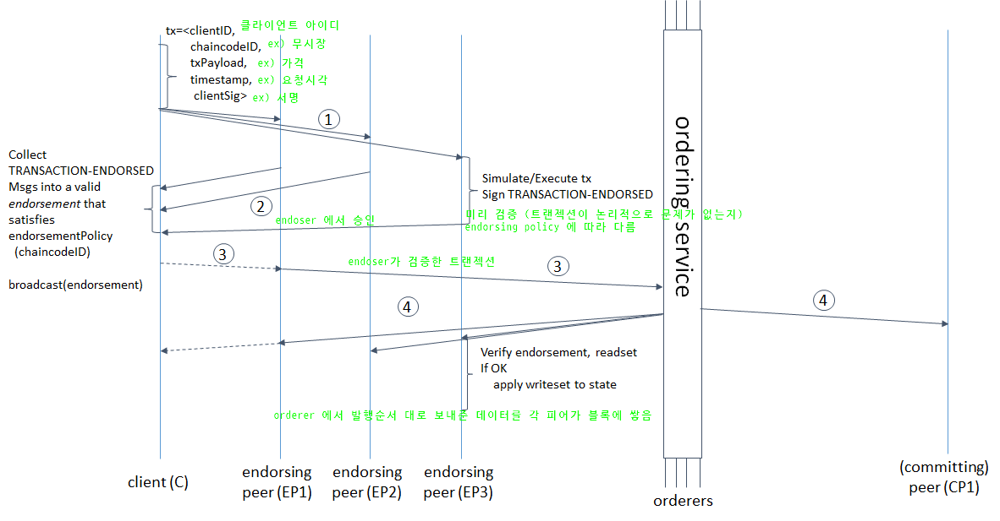

블록체인
========

목차
---------
### 1.
### 2.
### 3.
### 4.
### 5.


---------------
### 메모

### 용어
* **원장**
    > 거래 장부 
* **트랜잭션**
    > 거래 기록
* **블록**
    > 거래 장부    
* **용어**
    > 정의    
* **용어**
    > 정의   
* **용어**
    > 정의    
* **용어**
    > 정의   
* **peer**
    > 구성요소간 일대일이거나 노드를 사용해 특정행위를 하는 사람.  
* **node**
    > 전체 시스템의 하나의 구성요소   
* **docker**
    > 각각 컨테이너로 격리된 환경을 만들어주는 도구 (Host OS - Docker Engine - Container)
* **vagrant**
    > 설정 스크립트 기반으로 특정 환경의 가상머신을 빠르고 간편하게 만들고 공유할 수 있는 도구

------------------------
블록체인이란 무엇인가?
========================
* **블록체인**
    > * 무결성을 확보하고 유지하기 위해 순서에 따라 연결된 블록들의 정보 내용을 암호화 기법과 보안기술을 이용해 협상하는 알고리즘으로 구성된 소프트웨어 요소를 활용하는 원장의 순수 분산 P2P 시스템  
    > * 분산시스템에서 무결성을 확보하게 해주는 도구    
* **블록체인 목적**
    > 무결성 확보 및 유지    
* **분산 시스템의 장점**
    > 1.계산능력(분산>단일)  
    2.비용절감  
    3.안정성  
    4.확장성
* **분산 시스템의 단점**
    > 1.조정·통신 오버헤드 발생  
    2.네트위크 의존도↑  
    3.프로그램 복잡  
    4.보안문제
* **P2P 시스템**
    > 여러 노드들로 구성된 분산 소프트웨어 시스템
* **P2P 시스템의 특징**
    > 한 노드의 자원(계산 능력, 저장 공간, 정보 배분 등)을 다른 노드들이 직접 사용(상호작용)
    * **P2P 시스템의 주요 관심사**
    > 신뢰와 무결성
* **P2P 무결성 위협 요인**
    > 1.기술적 결함  
    2.악의적 피어
* **P2P 무결성 확보에 영향을 미치는 요소**
    > 1.전체 피어 개수에 대한 지식  
    2.각 피어의 신뢰성에 대한 지식
* **비잔틴 장군 문제**
    > 1982년, 레슬리 램포트가 분산 네트워크의 오류에 대처하는 방법을 논하기 위해 처음으로 제기한 명제.   
    전투에 나선 비잔틴 제국의 장군들이 공격/퇴각 명령을 서로 주고 받아야 하는데 반역자가 섞여 있어 메시지가 정확히 전달 될 것이라는 보장이 없다는 것.
* **식별(identification)**
    > 누구라고 주장하는 것
* **인증(authentication)**
    > 당신과 당신이라고 주장하는 누군가가 일치하는지 증명하는 것
* **승인(authorization)**
    > 인증된 개체에게 무엇인가에 대한 접근을 허가하는 것
* **이중사용(double spending)문제**
    > 소유권 이전이 불분명해 지는 경우
* **블록체인 네가지 의미**
    > * 데이터 구조 (구체적 정보나 내용과 상관없이 데이터를 정리하는 빙식)
    >    * 블록이라 불리는 단위에 모인 모든 데이터  
    > * 알고리즘 명칭
    >    * 투표 방식과 비슷한 방법을 써서 서로 협상 하는 일련의 명령어
    > * 기술묶음의 명칭
    >    * 블록체인-데이터구조,블록체인-알고리즘,암호화 및 보안 기술의 조함
    > * 포괄적 의미
    >   * 블록체인-기술묶음을 활용하는 거래장부(원장)들의 순수 분산 P2P 시스템
* **원장의 역할**
    > 1.원장에서 읽은 과거 데이터를 이용해 소유권을 증명해주는 수단  
    > 2.소유권의 이전이 발생한 경우 원장에 새로운 데이터를 생성하여 문서화해두는 역할
* **소유권을 관리하는 원장의 순수 분산 P2P 시스템**
    > * 소유권 기술
    > * 승인받지 않은 접근으로부터 소유권 보호
    > * 트랜잭션 데이터 저장
    > * 신뢰할 수 없는 환경에 배분할 원장 준비
    > * 분산 원장 시스템 형성
    > * 새로운 트랜잭션 검증 및 추가하기
    > * 진실을 담은 원장 가려내기
* **소유권을 기술 하는 방식**
    > * 소유권 목록 작성
    >   - 현상태만 설명
    >   - 예시) 잔고증명서
    > * 트렌잭션 데이터
    >   - 소유권의 이전 이력을 기술
    >   - 예시) 거래내역 조회서

* **트랜잭션 이력의 무결성을 유지하기위해 필요한 3요소**
    > 1.형식적 정확성
    >   - 필요한 모든 정보를 정확한 형식으로 기술하는 것  

    > 2.의미상 정확성
    >   - 트랜잭션 데이터의 의미와 의도한 결과와 관련
    >   - 해당 사업 영역에 대한 지식이 있어야 검증할수 있다.
    >   - 예시) 한번의 트랜잭션으로 이전 가능한 최대 금액에 제한을 둔다...등  

    > 3.승인
    >   - 트랜잭션 데이터는 계좌 소유자가 정말로 소유권 이전에 동의하는지 증명할 수 있는 정보를 반드시 가지고 있어야 한다.

* **소유권 기록**
    >* 소유권 이전을 기술 / 트랜잭션 이력의 유지
    >* 원장에 기록된 트랜잭션의 모든 이력은 각자 어떤 식으로 소유권을 획득했는지 알려주는 증가가 되어 감사 추적 자료가 된다.  
    >* 트랜잭션이 이력에 포함된 순서는 반드시 유지되어야 한다. 그래야 데이터를 합쳐 결과를 생성했을 때 동일한 결과가 만들어지기 때문이다.
    >* 무결성유지를 위한 트랜잭션 데이터 - 형식성 정확성(필요정보를 정확한 형식으로 기술했는가), 의미상 정확성(데이터의 의미와 의도한 결과가 일치하는가), 승인 (합의?)

* **해싱데이터 5가지 패턴***
    >* 독립해싱
    >> * 각 데이터에 독립적으로 해싱 적용
    >* 반복해싱
    >> * 해시 출력값에 함수를 한번더 적용
    >* 결합해싱
    >>* 하나 이상의 데이터에 해싱을 한번만 적용하여 단일 해시값을 얻는 방법
    >* 순차적 해싱
    >>* 새로운 데이터가 도착할 때마다 해시값을 즉시 갱신하는 것
    >>* 특정 시점의 해시값으로 해당 데이터가 도착한 시점을 추적 가능
    >* 계층적 해싱
    >>* 두 해시값에 결합 해싱을 적용하여 최상위에 단일 해시값을 가지는 작은 계층 형성하는 것 
 * **데이터 해싱하기**
    >* 해시함수 : 어떤 형태의 데이터든 입력 데이터의 길이와 상관없이 고정된 길이의 숫자로 변환 하는 함수
    >* 암호화 해시 함수 (Cryptographic hash function)  
     → 어떤 종류의 데이터든 즉시 해시값 제공(어떤종류든 빠르게 해시값 제공)
     → input이 같으면 output 도 같다(확정적)  
     → input 데이터 변하면 예측 불가하게 변경(의사 난수)  
     → output으로 input을 알수 없음(일방 함수)  
     → 동일한 해시값 생성 어려움(충돌 회피)
* **해시 참조**
    >* 암호화 해시값을 활용
    >* 데이터의 고유한 지문
    >* 해시참조가 깨진 것은 해시 참조가 생성된 이후 데이터가 변경되었다는 증거가됨.
* **머클트리**
    > 토너먼트 대진표 같이 생긴 트리구조. 트랜젝션을 쌍으로 암호화하여 최종적으로 하나의 결과값(머클루트)이 나온다. 데이터의 간편하고 확실한 인증을 위해 사용.  
    [참조링크](https://steemit.com/kr/@yahweh87/4-merkle-tree-merkle-root) 
* **블록체인은 변경이 어렵다**
    > 체인형태로 되어있어 계속적인 참조가 일어나고 데이터가 바뀌면 해쉬값도 모두 변하기 때문에 (ex:복잡하게 설계 되어있는 소스 → 이클립스 계속적인 빨간줄...)
* **해시 퍼즐**  
    ```
        int difficulty = 5;                     //난이도
        int nonce = 0;                          //난스
        Data data = getData();                  //데이터
        Output output = null;                   //해시값
        while(!flag){                           //결과
            output = getHashValue(data,nonce);
            flag = isSolved(ouput,difficulty);  //제약조건을 만족시키는가
            nonce++;
        }
    ```
* **해시값 용도***
    >* 데이터비교
    >* 바뀌어서는 안되는 데이터가 변경되었는지 감지
    >* 변경-감지 방식으로 데이터를 참조
    >* 변경-감지 방식으로 데이터를 저장
    >* 계산량이 많이 필요한 과제 생성
* **블록헤더정보**
    >* 직전 블록의 헤더를 가리키는 해시참조  
    >* 트랜잭션 데이터를 갖고 있는 머클 트리의 루트
    >* 해당 해시 퍼즐의 난이도
    >* 해시 퍼즐 풀이를 시작한 시각
    >* 해시 퍼즐을 해결할 난스
* **용어**
    > 정의
* **용어**
    > 정의
* **용어**
    > 정의
* **용어**
    > 정의
* **용어**
    > 정의
* **용어**
    > 정의
* **용어**
    > 정의
* **용어**
    > 정의
* **용어**
    > 정의
* **용어**
    > 정의


### 블록체인의 종류
* **Public Blockchain**
    > 누구나 네트워크에 참여할 수 있는 블록체인 (비트코인,이더리움...)
* **Private Blockchain**    
    > 하나의 기관에서 독자적으로 사용하는 블록체인
* **Consortium Blockchain**
    > 여러 기관들이 컨소시움을 이뤄 구성하는 블록체인, 허가된 기관만 참여가능

------------------------
Hyperledger Fabric
========================
## 목차
------------------------
1.  목표
2.  특징 
3. 
4. 
------------------------
* ### 목표
    > 1. 알려진 참가자들을 대상으로 하는 비즈니스 응용 환경에 맞는 블록체인 개발  
    > 2. 서로 다른 요구사항을 가지는 다양한 분산 응용 개발을 효율적으로 지원할 수 있는 플랫폼 개발  
    > 3. 모듈 구조를 가지는 분산 응용 플랫폼 개발 → 합의 프로토콜, 맴버십 서비스 등의 모듈을 필요에 따라 교체 가능
------------------------
* ### 특징
    1. 허가형(permissioned) 블록체인  

        > * 맴버십 관리 서비스를 통해 허가된 참여자만 접근 허용
        > * 참여자의 블록체인 접근 권한을 제어 가능  
        > * x500 기반 PKI

         | 구분  | 비허가형 블록체인  | 허가형 블록체인  |
         |---|---|---|
         | 참여자 관리  | 없음  | 있음  |
         | 접근권한 제어  | 불가능  | 가능  |
         | 책임성  | 없음  | 있음  | 
         | 합의 알고리즘  | 작업 증명  | 비작업 증명 유형(ex.투표)  |
         | 거래 완료성  | 낮음  | 높음 |  

         ※ 거래 완료성 : 거래가 완전성을 가질 확률  

    2. 일반 프로그래밍 언어 사용

        > * 체인코드(chaincode) : 하이퍼레저 패브릭의 스마트 계약 프로그램
        > * 이더리움 : 모든 피어의 블록체인에서 실행된 스마트 계약의 결과가 항상 동일한 것을 보장하기 위해 결정적(deterministic) 프로그래밍 언어를 특별히 개발 하여 사용(ex.Solidity)
        > * 하이퍼레저 패브릭 : Go,Java 등 일반적인 프로그래밍 언어 사용  

    3. 내부 가상통화 부재 

        > * 내부 가상 통화가 필요한 경우 : 1. 거래 수수료 지불 2. Dos 공격 방지  
        > * 비작업 증명 방식의 합의 : 수수료 불필요
        > * 지정된 보증 피어(endorsing peer)만 체인 코드 실행
        > * Dos 공격은 해당 보증 피어들에만 영향
        > * 보증 피어가 내부 정책을 통해 체인코드 실행 포기 시점 결정 가능 → 무한한 체인코드 실행 방지 가능

    4. 높은 성능(tps 10000)

        > * 서로 다른 보증 피어들을 통해 체인코드를 실행하는 다수의 거래들을 동시 처리 가능 → 높은 성능  
        > * 정보 이름에 해당하는 키의 버전 관리를 통해 동시 처리에 따른 비결정적 실행 문제 해결

    5. 교체 가능한 모듈 구조

        > * 하이퍼레저 패브릭은 전체 시스템을 모듈 구조로 설계하고, 합의 알고리즘 등 응용에 따라 요구사항에 차이가 큰 모듈을 필요에 따라 교체 가능
        > * 합의 프로토콜 : SOLO, Kafka, PBFT(Practical Byzantine Fault Tolerant) 등

    6. 멀티 블록체인

        > * 전체 시스템을 다수의 채널(channel)로 구분
        > * 채널별로 별도의 독립적인 블록체인 유지 기능
        > * 참여자는 특정 채널에 가입함으로써 공유할 블록체인을 선택할 수 있고, 다수의 채널에 가입 가능

* 이더리움과 하이퍼레저 패브릭 비교

    |구분|이더리움|하이퍼레저 패브릭|
    |---|---|---|
    |유형|비허가형|허가형|
    |프로그램 이름|스마트 계약|체인코드|
    |프로그램 형태|결정적(deterministic)|비결정적(non-deterministic)|
    |내부 통화|있음(ETC)|없음|
    |거래 수수료|있음(gas)|없음|
    |프로그램 언어|자체언어(solidity)|일반 언어(Go,Java)|
    |거래 방식|순차적|병렬적|
    |합의 알고리즘|작업증명(PoW)|비작업 증명형(SOLO,Kafka,BFT 등)|
    |결제 완료시간|1분 이상|즉시|
    |멀티블록체이|미지원|지원|
* 블록체인 구조

    * 구성
        > * 레저(ledger-block+block) + 전체 상태(world state- vKVS->versioned Key-Value Store)

    * 전체 상태(world state)
        > * 거래 실행 결과에 따라 변경되는 블록체인의 상태 변화 정보를 저장
        > * 버전형 키-값 저장소(vKVS-versioned Key-Value Store) 형태로 모델링
        > * 키(Key) : 체인코드(chaincode)가 사용하는 정보 이름
        > * 값(value) : 이름에 대응되는 정보
        > * 버전(version)은 특정 키와 값의 쌍의 상태를 번호(number)로 표시
        > * 값이 갱신될 때마다 새로운 버전 번호(version number)가 부여되어 기존의 키-값의 쌍의 상태 구분
        > * 상태 변화의 예 : (car.no = 1234, car.owner = park, car.maker=Hyundai) → (car.no = 1234, car.owner=kim, car.maker=Hyundai)
        > * 키 버전 변화 : s(car.owner.value)=park), s(car.owner.version)=5) → s(car.owner.value)=kim), s(car.owner.version)=6)
        > * 전체 상태 = 블록체인의 모든 거래가 접근하는 키 집합에 대한 현재의 갑과 버전 정보 집합
        
    * 레저(ledger)
        > * 시스템 운영 과정에서 발생하는 모든 거래 정보를 해시체인(hash chain) 형태로 저장
        > * 블록에 포함되는 거래의 수는 응용의 요구사항에 따라 달라질 수 있음
        > * 레저를 통해 전체 상태 변경의 이력 추적 가능


* **flow**
